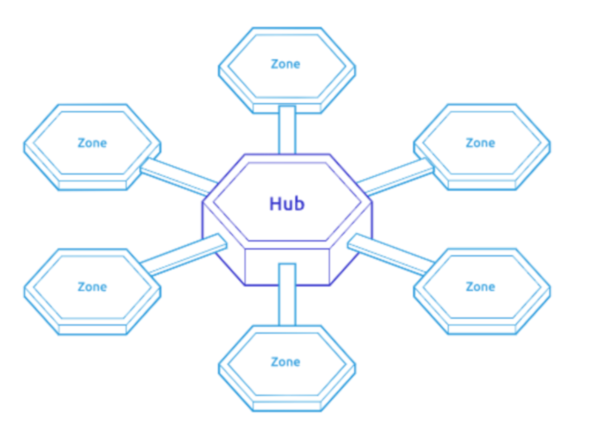

# Welcome to akhirachain

akhirachain is the world's first omni-chain decentralized exchange. Built with the Cosmos SDK, akhirachain is 100x more efficient than current leading DeXes. akhirachain inherits the cross-chain capabilities of Thorchain and uses pegged tokens to support cross-chain transactions across a wide array of blockchains.

### Cross-Chain Development

akhirachain will support cross-chain transactions for 20-25 of the top blockchains such as Bitcoin, BinanceChain, Polkadot, and EOS. These blockchains represent the overwhelming majority of all cryptocurrency trading volume and will setup akhirachain to be used with a wide variety of cryptocurrencies. It will also simplify the process of blockchain integration, lowering the barrier of cost and development for the open-source community.

Unlike Bitcoin or Ethereum, which work on _probabilistic_ finality of blocks, the Cosmos SDK provides finality _guarantees_. This is important in relation to the confidence that a block will be finalized. Since akhirachain is built on Cosmos, this feature is automatically baked in, which is essential for cross-chain token swaps.

### Peggy & Peg-zones

In order to accomplish this cross-chain support, akhirachain uses a concept called 'Peggy' to create a pegged token model. This model is inspired by the Cosmos’s peg zone model. A 'peg zone' is an account-based blockchain which bridges 'zones' within Cosmos to external chains like Bitcoin or Ethereum. These peg zones are what allow assets to be easily transferred between akhirachain and the external chain. Peg-zones can even be used for cross-chain transfers between a finalistic and probabilistic blockchain.

Peg-zones can also be thought of as a blockchain that tracks the state of another blockchain. By doing this, it acts as an adaptor zone or a “finality gadget”, which translates finality for probabilistically finalized blockchains by imposing a “finality threshold” at some arbitrary number of blocks to achieve pseudo-finality. Generally, this “translator” zone design can be classified as a 2-way peg \(2WP\).

akhirachain uses a two-way peg protocol, which allows the swapping of pegged tokens. For example, a trade of currencies LTC for TRX would be executed as transactions of pegged versions of those tokens \(cLTC and cTRX\) on the Cosmos SDK blockchain. akhirachain users will trade with pegged tokens within the akhirachain system. 

In Peggy's mature state, not only does the usage of these pegged tokens create a highly scalable design, it also has unique crypto-economic incentives for its participants. For instance, akhirachain validators only need to run 'akhiranode' \(akhirachain's network\) and can leave the cross-chain transaction labor to peg zone validators. Each peg zone validator only needs to run a node for the peg zone blockchain and the external blockchain \(ie. Bitcoin or Ethereum\) and can then send assets to and from akhirachain through Inter-Blockchain Communication \(IBC\). 

akhirachain's initial Peggy design will be slightly different than this due to the immaturity of IBC. At initial launch, Peggy and akhiranode will co-exist together within akhiranode. This allows akhirachain to support cross-chain transfers, adding & removing of liquidity, and token swaps from day 1 without the reliance of IBC. Once IBC has matured and is production-ready, we will shift to this model to realize its scalable benefits.

akhirachain is actively evaluating multiple cross-chain software frameworks that appear to have successfully implemented cross-chain data or value transfers. These include [Gravity](https://gravity.tech/), ChainBridge, Rosetta, Substrate-IBC, the Nomic Bitcoin bridge, PolyNetwork, and other projects.

### Continuous Liquidity Pools

[**Liquidity pools**](https://www.investopedia.com/terms/l/liquidity.asp) ****enable you to buy or sell an asset for another asset on a crypto-currency exchange. Think of each liquidity pool as a mini-market within the larger market, ensuring reliability and expediency when you trade two different tokens.

Liquidity pools are important in[ **decentralized finance \(DeFi\)**](https://www.coindesk.com/what-is-defi) ****— particularly decentralized exchanges \(DEX\). Because akhirachain is the world’s first omni-chain DEX, this technology is fundamental to our vision. We use something called a Continuous Liquidity Pool \(CLP\).

Centralized exchanges \(e.g. Coinbase, New York Stock Exchange\) use [**order books**](https://www.investopedia.com/terms/o/order-book.asp): marketplaces where buyers and sellers come together, respectively trying to buy at the lowest possible price and sell at the highest possible price.

akhirachain uses a hybrid model with both an order book and CLPs.

### Governance

Inspired by Compound, YFI, and Synthetix, akhirachain will make use of decentralized governance with AkhiraDAO.

AkhiraCore \(the core team of akhirachain\) is [very focused on the development of AkhiraDAO](https://twitter.com/akhirachain/status/1323162320382517248?s=20) and a total transition of governance power over all aspects of the protocol. We expect to follow best practices from [metagovernance](https://metagov.org/wp-content/uploads/2020/04/Metagov-Full-Deck-public-2020-04-18.pdf) including the restructuring of AkhiraDAO’s governance on a regular \(most likely quarterly\) basis.

For true self-sovereignty, akhirachain’s development should be self-funding and self-sustaining. We look to models like Linux and Wikipedia as examples of institutions that have maintained the funding needed to continually produce critical open-source resources. We’re exploring a partnership with [a research lab at UC Davis](https://engineering.ucdavis.edu/news/uc-davis-computer-science-communication-team-study-open-source-software) to formalize properly funded open-source development as a hallmark of akhirachain’s governance.

We want the market’s inherent super forecasting abilities to be turned towards optimizing akhirachain’s development. Governance will engage market-based performance evaluation within AkhiraDAO through tools like [alpha bonds](https://github.com/blockscience/interchainfoundation). Wherever possible, we want the market to govern akhirachain through on-chain crypto-economic incentives for AkhiraDAO members.

Feel free to see our Tweets on how the AkhiraDAO could possibly take shape: [https://twitter.com/akhirachain/status/1323162320382517248?s=20](https://twitter.com/akhirachain/status/1323162320382517248?s=20)

#### Security

To ensure the security of the akhirachain ecosystem, the AkhiraCore team will lead the development and deployment of each bridge. The AkhiraCore team intends to give all bridges the same security guarantees as described in the [general case](https://app.gitbook.com/@akhirachain/s/akhirachain/~/drafts/-MR1K8Tq8VRB5PXYz9on/core-concepts/al-jabaal/general-case-mode-for-pegged-tokens) and model extensions. We may use Rowan as the collateral for these bridges or we may create another token solely to be used by these peg zones depending on a successful implementation of the rebalancing mechanism and market conditions.

